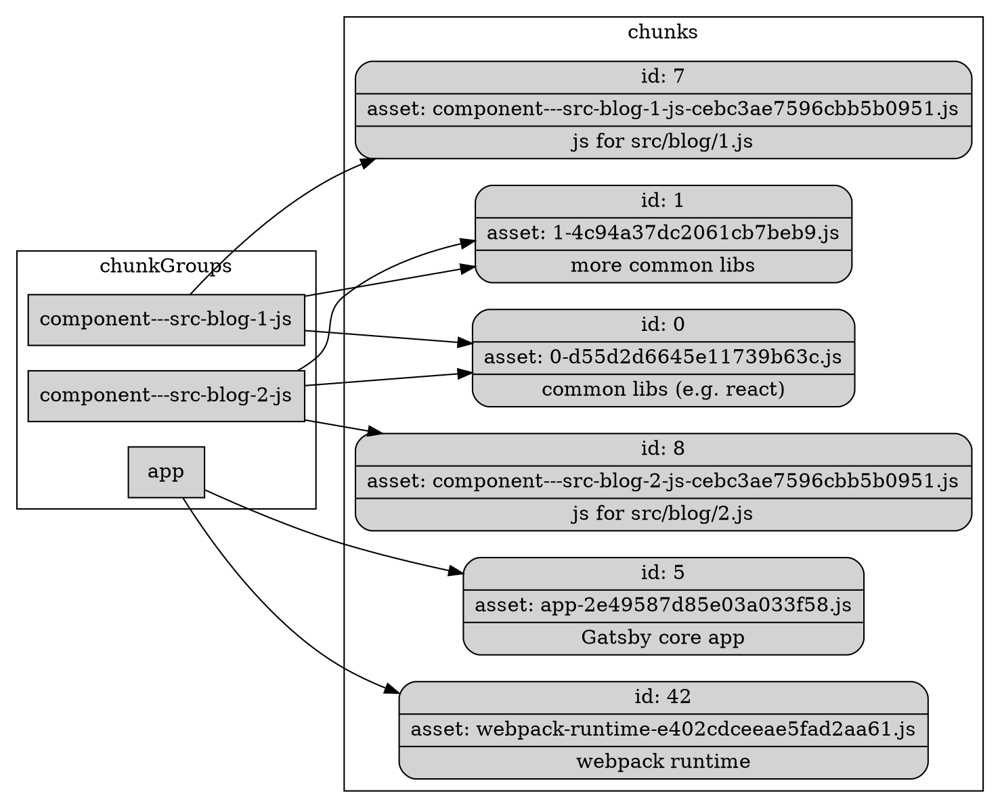

En Gatsby, la división de código ocurre durante la compilación de _webpack_ a través de [División dinámica](https://webpack.js.org/guides/code-splitting/#dynamic-imports). Durante la compilación, si _webpack_ encuentra una invocación a una función `import`, dividirá el archivo importado en un _bundle_ separado. Si los módulos son cargados mediante `require`, no se les aplica división de código, sino que se incluyen en el _bundle_ original.

Pero, ¿cómo saber qué módulos/archivos dividir? Afortunadamente, hay una respuesta natural. ¡Páginas! Al cargar una página, no hay razón por la cual también se tengan que subir los archivos JavaScript/CSS para todas las otras páginas del sitio (excepto si se quiere hacer _prefetch_ de estas, lo cual veremos [más adelante](/docs/how-code-splitting-works/#prefetching-chunks)). La tarea de Gatsby es hacer el trabajo pesado de generar el JavaScript correcto en la forma en que _webpack_ espera realizar esta división de código.

## .cache/async-requires.js

Durante la [Write Out Pages](/docs/write-pages/#async-requiresjs) bootstrap phase, le das salida a `.cache/async-requires.js`. Este archivo es crucial para la división de código. El archivo exporta un objeto `components` que asigna [ComponentChunkNames](/docs/behind-the-scenes-terminology/#componentchunkname) a funciones que importan el archivo del componente en el disco. Por ejemplo:

```javascript
exports.components = {
  "component--src-blog-js": () =>
    import(
      "/home/site/src/blog.js" /* webpackChunkName: "component---src-blog-js" */
    ),
  // más componentes
}
```

El punto de entrada a _webpack_ (`production-app.js`) [references ./async-requires.js](https://github.com/gatsbyjs/gatsby/blob/master/packages/gatsby/cache-dir/production-app.js#L15). Y, por lo tanto, _webpack_ lo analizará y encontrará el objeto que le asigna componentes a funciones que importan, dinámicamente, archivos de componentes de página. Según la división dinámica, _webpack_ creará _chunks_ separados para cada uno de esos archivos importados.

`async-requires` también exporta una función `data` que importa, dinámicamente, el archivo [data.json](/docs/write-pages/#datajson) para que también se divida el código.

## Cómo nombrar los paquetes de fragmentos

¡Genial! Le has indicado a _webpack_ dónde quieres dividir el código. Pero, ¿cómo se les nombrará en el disco? _Webpack_ te brinda la posibilidad de personalizar esto a través de la configuración [chunkFilename](https://webpack.js.org/configuration/output/#output-chunkfilename) en la sección [_output_](https://webpack.js.org/configuration/output/), la cual Gatsby establece en [webpack.config.js](https://github.com/gatsbyjs/gatsby/blob/master/packages/gatsby/src/utils/webpack.config.js#L135) como:

```text
[name]-[contenthash].js
```

_Content hash_ es simplemente un _hash_ de los contenidos del _chunk_ que se dividieron en código. Pero, ¿qué hay de `name`? Aún no le has dicho a _webpack_ el "nombre" del _chunk_, uno distinto al nombre del archivo, el cual no puede ser un nombre ya que contiene _slashes_. Normalmente, _Webpack_ reemplazaría `[name]` por `[id]` (conoce más en [documentos de _webpack_](https://webpack.js.org/configuration/output/#output-chunkfilename)). Pero, en cambio, nos da la oportunidad de especificar el nombre como un comentario en el `import block`. En el ejemplo anterior, eso es lo que hace el comentario `/* webpackChunkName: "component---src-blog-js" */`.

## Introducción a _chunkGroups_ y _chunks_

Antes de proceder a mostrar cómo Gatsby le asigna componentes a los nombres de los _bundles_ generados, debes entender cómo funcionan los _chunks_ de _webpack_. Un grupo de _chunks_ representa una división lógica de código, p. ej., una página de Gatsby o la aplicación principal de Gatsby. Los grupos de _chunks_ pueden compartir un montón de código o bibliotecas. _Webpack_ los detecta y crea piezas de código compartidas. Estos son _chunks_, p. ej., puede haber un _chunk_ para _React_ y otras bibliotecas. Luego, quedarían los _chunks_ sobrantes del código central de Gatsby JS para el grupo de _chunks_ en particular. Esto se explica más fácilmente mediante el siguiente gráfico.



En el gráfico anterior, puedes ver 3 grupos de _chunks_: 2 páginas y la aplicación principal de Gatsby. Las dos páginas comparten un montón de bibliotecas. _Webpack_ encontró estas dependencias comunes y creó _chunks_ para ellas. Estos _chunks_ son _id_ 0 y 1. Y verás que ambas páginas `chunkGroups` dependen de ellos. Cada página también depende de su propio _chunk_ que representa el código central de la página (de su código _src_ en el sitio Gatsby). Estos serían _id_ 7 para `component---src-blog-1-js` y 8 para `component---src-blog-2-js`.

También puedes ver el grupo de _chunks_ para `app`. Resulta que esto no comparte dependencias con las páginas. Pero sí incluye el tiempo de ejecución de _webpack_ cuyo nombre se declara en [webpack.config.js](https://github.com/gatsbyjs/gatsby/blob/master/packages/gatsby/src/utils/webpack.config.js#L390).

Recuerda que el nombre del grupo de _chunks_ fue asignado por `/* webpackChunkName: .../*` en la sección anterior.

## Referenciar _chunks_ al generar HTML

Webpack ahora puede dividir tu código en diferentes _bundles_, y los has nombrado apropiadamente. Pero, esos _bundles_ seguirán siendo nombrados con un _content hash_. P. ej., para un componente `component--src-blog-js`, el _chunk bundle_ de salida podría ser nombrado como `component--src-blog-js-2e49587d85e03a033f58.js`. _Webpack_ reemplazará las invocaciones a `import()` por enlaces a los nombres de archivo de los _bundles_ generados. Esto funciona muy bien para tus _bundles_ de JavaScript puro. Pero las cosas se complican al generar los archivos HTML de tu página.

La generación de archivos HTML está cubierta en los documentos de [Generación de Páginas HTML](/docs/html-generation/). En resumen, _webpack_ construye un archivo `static-entry.js` que produce un _bundle_ `render-page.js`. Esta es una función que acepta una página y renderiza su HTML. El contenido HTML es suficiente para impulsar un sitio y mejorar el _SEO_, pero una vez que se carga la página, Gatsby también carga el _bundle_ de JavaScript para que la renderización de la página ocurra en el lado del cliente a partir de ese momento. Esto ofrece la ventaja de cargas de página iniciales rápidas combinadas con renderización en el lado del cliente para futuros clics en la página.

Para hacer esto, debes poder crear etiquetas `<link>` y `<script>` en el HTML, en el _chunk_ del _runtime_ de Gatsby, y en el _chunk_ de la página (p.ej. índice). Pero como se mencionó anteriormente, solo _webpack_ conoce el nombre del nombre de archivo generado para cada _chunk_. `componentChunkName` es lo único que Gatsby conoce.

#### webpack.stats.json

Resulta que _webpack_ proporciona una forma de registrar la asignación. Provee un _hook_ de compilación llamado [_done_](https://webpack.js.org/api/compiler-hooks/#done) para el cual te puedes registrar. Proporciona una estructura de datos [_stats_](https://webpack.js.org/api/stats/) que contiene todos los `chunkGroups` (recuerda que el _chunk Group_ es el `componentChunkName`). Cada grupo de _chunks_ contiene una lista de los _chunks_ de los que depende. Gatsby provee un _plugin_ personalizado para _webpack_ llamado [GatsbyWebpackStatsExtractor](https://github.com/gatsbyjs/gatsby/blob/master/packages/gatsby/src/utils/gatsby-webpack-stats-extractor.js) que implementa este _hook_ y escribe la información del _chunk_ en `/public/webpack.stats.json` (bajo el _key_ `assetsByChunkName`). P. ej.

```javascript
{
  "assetsByChunkName": {
    "app": [
      "webpack-runtime-e402cdceeae5fad2aa61.js",
      "app-2e49587d85e03a033f58.js"
    ],
    "component---src-blog-2-js": [
      "0.f8e7f9e53550f997bc53.css",
      "0-d55d2d6645e11739b63c.js",
      "1.93002d5bafe5ca491b1a.css",
      "1-4c94a37dc2061cb7beb9.js",
      "component---src-blog-2-js-cebc3ae7596cbb5b0951.js"
    ]
  }
}
```

##### chunk-map.json

`webpack.stats.json` asigna grupos de _chunks_ (componentChunkNames) a los nombres de los activos de _chunks_ de los que depende. Tu [_hook_ compilador de _webpack_ de Gatsby](https://github.com/gatsbyjs/gatsby/blob/master/packages/gatsby/src/utils/webpack.config.js#L234) también le da salida a `chunk-map.json`, lo cual es una asignación de _chunkGroup_ al _chunk_ principal para el componente, contrario a los _chunks_ compartidos (_id0_ e _id1_ en el [diagrama introductorio](/docs/how-code-splitting-works/#primer-on-chunkgroups-and-chunks)). Esto renderizará el _chunk_ de un solo componente para JavaScript y CSS dentro de cada grupo de _chunks_. P. ej.

```javascript
{
  "app":["/app-2e49587d85e03a033f58.js"],
  "component---src-blog-2-js": [
    "/component---src-blog-2-js-cebc3ae7596cbb5b0951.css",
    "/component---src-blog-2-js-860f9fbc5c3881586b5d.js"
  ]
}
```

#### Cómo referenciar _chunks_

Estos dos archivos son cargados por [static-entry.js](https://github.com/gatsbyjs/gatsby/blob/master/packages/gatsby/cache-dir/static-entry.js#L16) para que pueda buscar activos de _chunks_ para _componentChunkNames_. Esto ocurre en dos lugares.

##### Construcción de etiquetas _link_ y _script_ para la página actual

Como ya se ha mencionado, `static-entry.js` genera HTML, pero también carga el _runtime_ de JavaScript de Gatsby y el JavaScript de la página para la que se está generando HTML. Estos se agregan como etiquetas `link` en `<head>` (más detalles en [precarga de etiquetas link](https://developer.mozilla.org/en-US/docs/Web/HTML/Preloading_content)), y luego son referenciados al final de _body_ en etiquetas `script`.

El _bundle_ del _runtime_ de Gatsby se llama `app` (nombre de salida de [webpack.config.js](https://github.com/gatsbyjs/gatsby/blob/master/packages/gatsby/src/utils/webpack.config.js#L169)). Tú [buscas assetsByChunkName](https://github.com/gatsbyjs/gatsby/blob/master/packages/gatsby/cache-dir/static-entry.js#L204) mediante `app` para obtener sus archivos de activos de _chunks_. Luego, haces lo mismo para el componente al buscar la misma colección a través de `componentChunkName` (p. ej. `component---src-blog-2-js`). Estos dos _arrays_ de activos de _chunks_ se fusionan. Para cada _chunk_ que contenga, crea el siguiente enlace y agrégalo a [headComponents](https://github.com/gatsbyjs/gatsby/blob/master/packages/gatsby/cache-dir/static-entry.js#L259).

```html
<link
  as="script"
  rel="preload"
  key="app-2e49587d85e03a033f58.js"
  href="/app-2e49587d85e03a033f58.js"
/>
```

`rel="preload"` le indica al navegador que comience a descargar este recurso con alta prioridad, ya que es probable que se haga referencia más adelante en el documento. Esperemos que para cuando llegue el momento, el recurso ya haya sido devuelto por el servidor.

Luego, al [final de _body_](https://github.com/gatsbyjs/gatsby/blob/master/packages/gatsby/cache-dir/static-entry.js#L331), incluye la verdadera etiqueta _script_ que hace referencia al activo precargado.

```html
<script
  key="app-2e49587d85e03a033f58.js"
  src="app-2e49587d85e03a033f58.js"
  async
/>
```

Si el activo es CSS, [insértalo _inline_ en el _head_](https://github.com/gatsbyjs/gatsby/blob/master/packages/gatsby/cache-dir/static-entry.js#L311).

```html
<style
  data-href="/1.93002d5bafe5ca491b1a.css"
  dangerouslySetInnerHTML="...contents of public/1.93002d5bafe5ca491b1a.css"
/>
```

##### _Prefetching chunks_

Como se mostró anteriormente, Gatsby usa _"preload"_ para acelerar la carga de los recursos requeridos por la página. Estos son su CSS y su JavaScript principal, necesarios para ejecutar la página. Pero si pararas aquí, entonces cuando un usuario haga clic en un enlace a otra página, tendría que esperar a que se descarguen los recursos de esa página antes de mostrarla. Para acelerar esto, una vez que la página actual se haya cargado, Gatsby busca todos los enlaces en la página, y para cada uno, comienza a hacer _prefetch_ de la página a la que apunta el enlace.

Esto lo hace usando el parámetro `<link rel="prefetch" href="..." />`. Cuando el navegador vea esta etiqueta, comenzará a descargar el recurso pero con una prioridad extremadamente baja y solo cuando los recursos de la página actual hayan terminado de cargarse. Dirígete a los [documentos MDN sobre _prefetch_](https://developer.mozilla.org/en-US/docs/Web/HTTP/Link_prefetching_FAQ) para más información.

Así es como funciona. Todos los enlaces en los sitios de Gatsby usan el _plugin_ [gatsby-link](https://github.com/gatsbyjs/gatsby/tree/master/packages/gatsby-link), el cual provee un componente `GatsbyLink` que usa el enrutador de alcance. El atributo _"to"_ es la página a la que el navegador se dirigirá en caso de que se haga clic. Entonces, una vez que se invoca el _callback Link_ [componentDidMount](https://github.com/gatsbyjs/gatsby/blob/master/packages/gatsby-link/src/index.js#L61), agregamos la ruta _"to"_ al [_loader_ de production-app](https://github.com/gatsbyjs/gatsby/blob/master/packages/gatsby/cache-dir/loader.js#L223) para hacer _prefetch_.

En este punto, sabes cuál es la página a la que te estás dirigiendo y puedes recuperar sus `componentChunkName` y `jsonName` pero, ¿cómo calcularías el _chunkGroup_ generado para el componente?

`static-entry.js` [solicita `chunk-map.json`](https://github.com/gatsbyjs/gatsby/blob/master/packages/gatsby/cache-dir/static-entry.js#L20) y luego [lo inyecta en el _CDATA_](https://github.com/gatsbyjs/gatsby/blob/master/packages/gatsby/cache-dir/static-entry.js#L342) de HTML como `window.___chunkMapping` de manera que esté disponible para todo el código en [production-app.js](/docs/production-app/). P. ej:

```html
/*
<![
  CDATA[ */
    window.___chunkMapping={
      "app":[
        "/app-2e49587d85e03a033f58.js"
      ],
      "component---src-blog-2-js": [
        "/component---src-blog-2-js-cebc3ae7596cbb5b0951.css",
        "/component---src-blog-2-js-860f9fbc5c3881586b5d.js"
      ]
    }
  */ ]
]>
*/
```

Ahora, el _loader_ puede crear la ruta completa del activo del componente usando [chunkMapping](https://github.com/gatsbyjs/gatsby/blob/master/packages/gatsby/cache-dir/loader.js#L69). Luego construye, dinámicamente, una etiqueta `<link rel="prefetch" ... />` y la agrega al _DOM_ (en [prefetch.js](https://github.com/gatsbyjs/gatsby/blob/master/packages/gatsby/cache-dir/prefetch.js)).

Puedes ver que al hacer _prefetching_ no se aplica a los _chunks_ compartidos (p. ej. `id0` y `id1`). ¿Por qué? Esto es un _punt_. Suponemos que los _chunks_ compartidos se habrán cargado antes para otras páginas. Y si no, entonces la lógica de carga de la página principal lo descargará. Simplemente, no se le hará _prefetch_.

Algo más, el _prefetching_ se puede deshabilitar implementando la API del navegador [disableCorePrefetching](/docs/browser-apis/#disableCorePrefetching) y arrojando _true_. Este valor se verifica en [loader.enqueue](https://github.com/gatsbyjs/gatsby/blob/master/packages/gatsby/cache-dir/loader.js#L242). Un ejemplo de un _plugin_ que implementa esto es [gatsby-plugin-guess-js](https://github.com/gatsbyjs/gatsby/blob/master/packages/gatsby-plugin-guess-js/src/gatsby-browser.js#L3).
