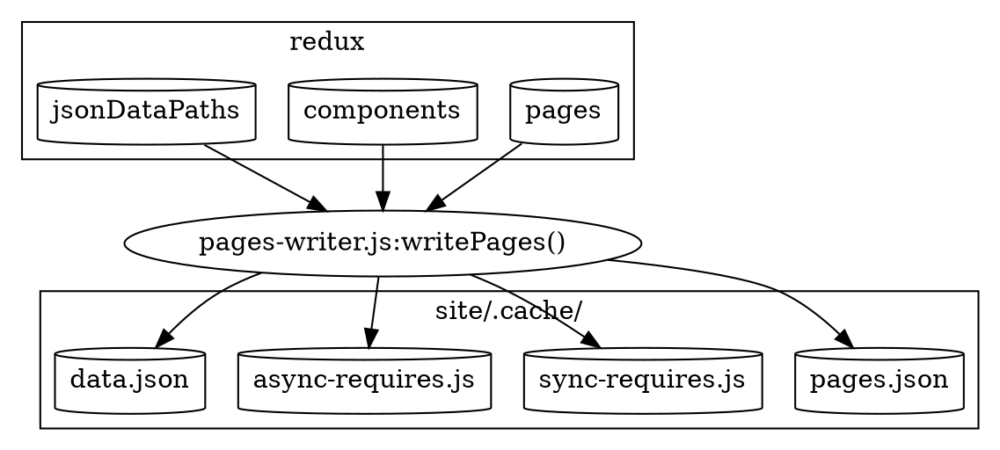

> Esta documentación no está actualizada con la última versión de Gatsby.
>
> Las áreas desactualizadas son:
>
> - `data.json` debería ser reemplazada con `page-data.json`
> - eliminar las menciones de `pages.json`
> - describir `match-paths.json`
>
> Puedes ayudar haciendo un PR para [actualizar esta documentación](https://github.com/gatsbyjs/gatsby/issues/14228).

Esta es una de las últimas fases de preparación antes de pasarnos a empaquetar la web para realizar una optimización en nuestro código y realizar la división de código. Webpack construye un _bundle_ web. Este no tiene conocimiento del código del núcleo de Gatsby. En su lugar, opera solo en los archivos en el directorio `.cache`. Además, no tiene acceso a toda la información de Redux creada durante el arranque. En cambio, creamos archivos JavaScript y JSON dinámicos que son dependientes del empaquetado web de la aplicación en el directorio `.cache` (ver [Montando la App de JavaScript](/docs/production-app/)). 

Puedes pensar en este paso como tomar todos los datos que fueron generados durante la preparación y guardarlos en el disco para el consumo por webpack.



La mayoría del código que respalda esta sección está en [pages-writer.js](https://github.com/gatsbyjs/gatsby/blob/master/packages/gatsby/src/internal-plugins/query-runner/pages-writer.js)

Los archivos dinámicos que son creados son (todos dentro del directorio `.cache`).

- [pages.json](#pagesjson)
- [sync-requires.js](#sync-requiresjs)
- [async-requires.js](#async-requiresjs)
- [data.json](#datajson)

## pages.json

Esto es una colección de objetos de página, creados desde el _namespace_ `pages` de redux. Para cada página incluye

- [componentChunkName](/docs/behind-the-scenes-terminology/#componentchunkname)
- [jsonName](/docs/behind-the-scenes-terminology/#jsonname)
- [path](/docs/behind-the-scenes-terminology/#path)
- [matchPath](/docs/behind-the-scenes-terminology/#matchpath)

Las páginas están ordenadas de forma que aquellas con `matchPath`s van antes que las que no tienen. Esto es para ayudar a [find-page.js](https://github.com/gatsbyjs/gatsby/blob/master/packages/gatsby/cache-dir/find-page.js) en la selección de páginas mediante regex, antes de probar las rutas explícitas. Mira [matchPaths](/docs/behind-the-scenes-terminology/#matchpath) para más información.

p. ej.

```javascript
;[
  {
    componentChunkName: "component---src-blog-2-js",
    jsonName: "blog-c06",
    path: "/blog",
  },
  // más páginas
]
```

`pages.json` está generado únicamente para propósitos de `gatsby develop`. En `npm run build`, usamos [data.json](/docs/write-pages/#datajson) (debajo) que incluye la información de las páginas, y más.

## sync-requires.js


Es un archivo de JavaScript generado dinámicamente que exporta `components`. Este es un objeto creado por iteración sobre el _namespace_ `components` de redux. Las claves son el [componentChunkName](/docs/behind-the-scenes-terminology/#componentchunkname) (p. ej. `component---src-blog-2-js`), y los valores son expresiones requeridas por el componente. P. ej. `/home/site/src/blog/2.js`. El archivo se verá parecido a este:


```javascript
exports.components = {
  "component---src--blog-2-js": require("/home/site/src/blog/2.js"),
  // más componentes
}
```

Este es usado durante [static-entry.js](https://github.com/gatsbyjs/gatsby/blob/master/packages/gatsby/cache-dir/static-entry.js) con lo que puede mapear _componentChunkNames_ con sus implementaciones de componentes. Mientras el [production-app.js](https://github.com/gatsbyjs/gatsby/blob/master/packages/gatsby/cache-dir/production-app.js) debe usar `async-requires.js` (debajo) debido a que realiza [División del código](/docs/how-code-splitting-works/).

## async-requires.js

---

`async-requires.js`  es muy similar a `sync-requires.js`, ya que es un archivo JavaScript generado dinámicamente. La diferencia es que está escrito para ser usado por la división del código via _webpack_ . Así que en lugar de usar `require` con la ruta del componente, este usa `import` y añade una pista con la que podremos enlazar eventualmente el _componentChunkName_ con su archivo resultante (más información en el documento [División de Código](/docs/how-code-splitting-works/)). `components` es una función, de forma que puede ser inicializada en diferido.

`async-requires.js` también exporta una función `data` que importa `data.json` ([Ver abajo](/docs/write-pages/#datajson))

Un ejemplo de _async-requires_ es:

```javascript
exports.components = {
  "component---src-blog-2-js": () =>
    import(
      "/home/site/src/blog/2.js" /* webpackChunkName: "component---src-blog-2-js" */
    ),
  // más componentes
}

exports.data = () => import("/home/site/.cache/data.json")
```

Recuerda, `sync-requires.js` es usado durante la [generación de página HTML](/docs/html-generation/). Y `async-requires.js` es usado por el [compilado de la aplicación de JavaScript](/docs/production-app/). 

## data.json

Este es un archivo json generado. Contiene todo los contenidos de `pages.json` ([como antes](/docs/write-pages/#pagesjson)), y el redux `jsonDataPaths` los cuales fueron creados al final de la fase de [ejecución de consulta](/docs/query-execution/#save-query-results-to-redux-and-disk). Se parece a: 

```javascript
{
  pages: [
    {
        "componentChunkName": "component---src-blog-2-js",
        "jsonName": "blog-2-c06",
        "path": "/blog/2"
    },
    // más páginas
 ],

 // jsonName -> dataPath
 dataPaths: {
   "blog-2-c06":"952/path---blog-2-c06-meTS6Okzenz0aDEeI6epU4DPJuE",
   // más páginas
 }
```

`data.json` es usado en dos lugares. Primero, es importado en diferido por `async-requires.js` (arriba), que a su vez es usado por `production-app` para [cargar resultados json](/docs/production-app/#load-page-resources) para una página.

Este también es usado por la [generación de página HTML](/docs/html-generation/) de dos maneras:

1. `static-entry.js` produce un _compilado de webpack_ `page-renderer.js` que genera el HTML para una ruta. Requiere `data.json` y usa `pages` para buscar la página para la página.
2. Para obtener el `jsonName` desde el objeto _page_, y lo usa para construir una ruta de recurso para el actual resultado json teniéndola en cuenta al buscar en `data.json.dataPaths[jsonName]`.

Ahora que hemos escrito nuestra página de datos, podemos empezar con la [sección de Webpack](/docs/webpack-and-ssr/).
